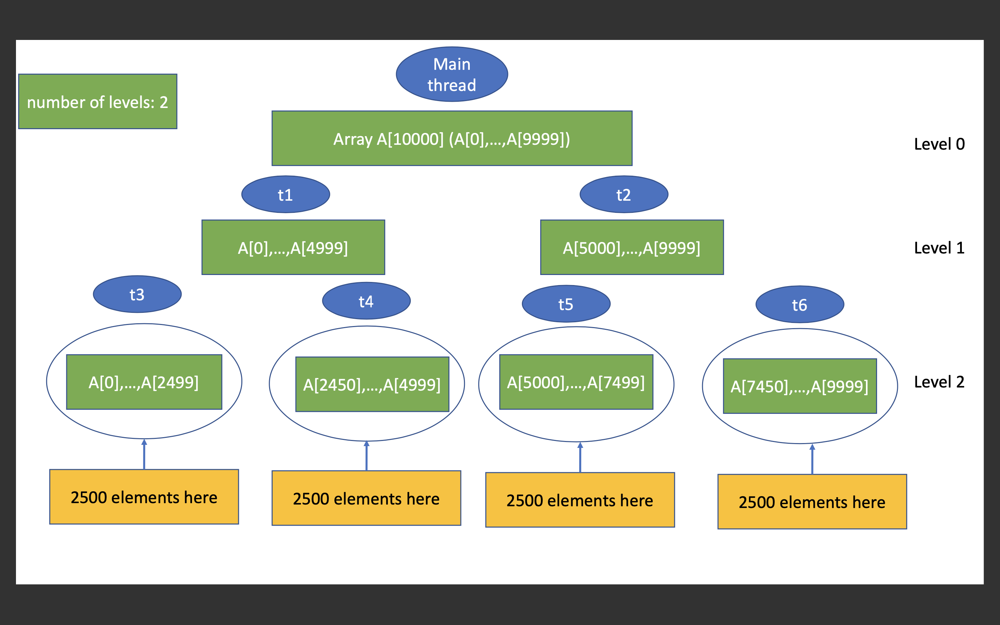
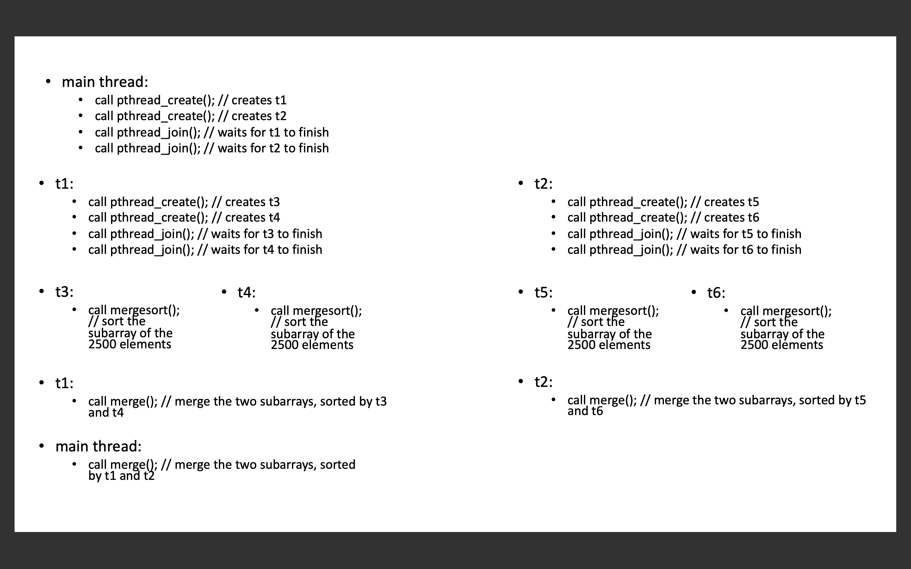

# Overview

In this assignment, we will implement a multi-threaded version of the merge sort algorithm (known as parallel merge sort) using the pthread library. Your code will then be used to sort a randomly-generated array. Note this is NOT a kernel project, and you should just develop your code on onyx, not in your virtual machine. Submissions fail to compile or run on onyx, will not be graded.

## Learning Objectives

- To gain more experience writing concurrent code.
- See how multithreading improves program performance.
- Explore the pthread library.

## Book References

Read these chapters carefully in order to prepare yourself for this project.

- [Intro to Threads](http://pages.cs.wisc.edu/~remzi/OSTEP/threads-intro.pdf)
- [Threads API](http://pages.cs.wisc.edu/~remzi/OSTEP/threads-api.pdf)

## Background

The classic and famous merge sort algorithm is an illustration of the divide-and-conquer idea. Parallel merge sort takes such an idea to the next level. The basic idea of parallel merge sort is demonstrated as below in this picture, using an example of an array whose size is 10,000. Although in this assignment we do not store any tree in our program, the idea itself sounds like we are dealing with a binary tree. We keep dividing the array, and create new threads to handle the divided smaller arrays, which we will call them as the subarrays. In binary tree terminology, there is a term called level. The node at the very top is at level 0. Its two children are located at level 1, and its four grandchildren are located at level 2, etc.



The idea of parallel merge sort is, starting from level 0, we create two new threads, each handles half of the array (of the current node). We repeat such a process so as to extend the binary tree to the next level. As such, we will soon get to level 1, level 2, level 3, level 4, etc. In this assignment, we allow users to specify how many levels they want us to go, and the starter code therefore defines a global variable called *cutoff*, whose value is passed to the program by the user from the command line. The above picture shows an example of when the *cutoff* is specified as 2.

Continue this same example, the following picture shows what your program flow should look like.



Several functions are used in the above picture. Some of them are API functions you can call, others are the functions you need to implement. Read the next few sections of this README to understand more details about these functions.

## APIs

I used the following APIs.

```c
int pthread_create(pthread_t *thread, const pthread_attr_t *attr, void *(*start_routine) (void *), void *arg);
```
According to its man page, the **pthread_create**() function creates "a new thread in the calling process.  The new thread starts execution by invoking start\_routine(); arg is passed as the sole argument of start\_routine()". You can create a *struct pthread_t* instance and pass its address into **pthread_create**(), as its first parameter, which represents the thread you are going to create. The second parameter *attr* describes some attributes of this thread, and for this assignment, you can juse use NULL, which indicates the thread is created with default attributes. The third parameter, *start_routine*(), is the function you want the newly created thread to run, this function must take one and only one parameter, which must be a *void* \* type pointer. This function returns a *void* \* type pointer. The four parameter is the argument, which is also known as the parameter, of this function - the one represented by the third parameter. For obvious reason, *arg* is a *void* \* type pointer.

```c
int pthread_join(pthread_t thread, void **retval);
```

According to its man page, The  **pthread_join**() function  "waits for the thread specified by thread to terminate. If that thread has already terminated, then **pthread_join**() returns immediately". After calling **pthread_create**() to create threads, you may want to wait for these threads to complete. And that is why you call **pthread_join**(). The first parameter of **pthread_join**(), which is *thread*, is also the first parameter of **pthread_create**(), however, **pthread_create**() takes its address as the parameter, whereas **pthread_join**() takes the variable itself as the first parameter. The second parameter *retval*, indicates the exit status of the thread (you are waiting for). In this assignment, you can set this *retval* to NULL, because in this assignment, we do not really care about the exit status of each thread.

```c
void *memcpy(void *dest, const void *src, size_t n);
```

You may need to call **memcpy**() in your **merge**() function, so as to copy data from one array to another array.

```c
void *malloc(size_t size);
void free(void *ptr);
```

You may need to call **malloc**() to allocate memory in your **buildArgs**() function for the argument you are going to build. You can then free such memory chunks in your **parallel_mergesort**().

You may have heard of **pthread_exit**(), do not use it for this assignment, otherwise valgrind will report memory blocks "still reachable" issues. valgrind has trouble to track variables used in **pthread_exit**(). In this assignment, instead of using **pthread_exit**(), you can just return NULL to exit your thread.

## Starter Code

The starter code looks like this:

xxx

You will be modifying the xxx.c file. You should not modify the xxx.h file.

To run the start code, you just type make and run

xxx

This is how your code will be called by the test program:


## Implementation: Make Concurrent

You are required to implement the following 4 functions:

```c
void mergesort(int left, int right);
```

This function does the mergesort, with one single thread.

```c
void merge(int leftstart, int leftend, int rightstart, int rightend);
```

In a typical merge sort algorithm, the **mergesort**() function will eventually call **merge**(), which attempts to merge two already-sorted sub-arrays. You are highly recommended to write this **merge**() function as a recursive function.

```c
void * parallel_mergesort(void *arg);
```

This **parallel_mergesort**() function calls **mergesort**() as its base case. You are highly recommended to write this **parallel_mergesort**() recursively, using the pthread library functions. Note: the term recursion in the context of pthread, is slightly different from the term recursion you usually see. In the above **merge**() function, you call **merge**(), that is the typical recursion scenario you see in other recursive programs. In your **parallel_mergesort**(), you do not call **parallel_mergesort**() directly, instead, you call **pthread_create**(), which will then call **parallel_mergesort**(). In other words, in **merge**(), you call **merge**() directly, in **parallel_mergesort**(), you call **parallel_mergesort** indirectly.

```c
struct argument * buildArgs(int left, int right, int level);
```

The only reason we need this function, is because **pthread_create**() specifies that its **start_routine**() only allows one void \* type pointer, which means **parallel_mergesort**() only accept one void \* type pointer, yet the information we want to pass is more than just an address. Thus we can work around this by creating a struct variable and pass its address into **parallel_mergesort**(). That is the purpose of this **buildArgs** function, which basically prepares the argument for **parallel_mergesort**(). Eventually these two functions will be called like this:

```c
	struct argument *arg=buildArgs(0, n-1, 0);
	parallel_mergesort(arg);
```

## Global Variables and Pre-defined Data Structures

The starter code defines the following global variables, in xxx.h. Once again, do not modify xxx.h.

```c
int *A;
```

A represents the array you are going to sort. Each time you run the test program, A will point to a randomly-generated array. How do you know the size of this array? The size of this array is specified by the user who runs the test program. The user provides a command-line argument to specify the size, which is called *n* in the test program, and then *n-1* will be passed to your **buildArgs**() function.

```c
int *B;
```

A typical merge sort algorithm requires some extra storage, which is an array, whose size is the same as the original array - the array you want to sort. Watch this video to understand why such an extra array is needed: [Algorithms: Merge Sort](https://www.youtube.com/watch?v=KF2j-9iSf4Q&t=372s).

```c
int cutoff;
```

This global variable is described in the Background section of this README. The word cutoff means when the number of levels reaches this *cutoff* value we cut off new thread generation.

```c
struct argument {
    int left;
    int right;
    int level;
};
```


You must get a speedup of at least 2 with 4 or more cores
to get full credit on this project. Use n = 100,000,000 elements for
your testing.

The test program accepts a number of levels as a
command line argument. The updated version of test-mazda should show
timing results for the serial mergesort when the number of levels is 0,
and show timing results for the parallel mergesort when the number of levels is larger than 0.

## Hints

- You can stop the recursion using the number of levels in the sorting
  tree or by number of threads. It is simpler to stop it by the number
  of levels.
<!-- - You are recommended to do this: let child threads call pthread_exit() to exit.
  parent thread itself doesn't need to call pthread_exit(). This is a recommendation
  but is not a requirement, however, later on when you work on the Cadillac (threads library) project,
  you will see the vaule of doing this.-->

## Submission  

Due Date: 23:59pm, March 15th, 2022. Late submissions will not be accepted/graded.
All grading will be executed on onyx.boisestate.edu.
Submissions that fail to compile on onyx will not be graded.

## Grading Rubric (for Undergraduate students)

- [70 pts] Make concurrent
  - [40 pts] You got a speedup of at least 2 with 4 or more cores 
  - [20 pts] test-mazda.c accepts a number levels as a command line argument
  - [10 pts] Correctly creates new threads
- [10 pts] Compiler warnings **ALL files**
  - Each compiler warning will result in a 3 point deduction.
  - You are not allowed to suppress warnings
  - You must build with the flags ```-Wall -Wextra -Wpointer-arith -Wstrict-prototypes -std=gnu89```
- [10 pts] Valgrind reports no memory leaks or read/write errors
  - As reported by **runval.sh**
  - This is a **PASS/FAIL** score. 1 read/write error or leaking 1
    byte will result in a zero for this section. There is no partial
    credit for this section.
- [10 pts] Documentation: README.md file (replace this current README.md with a new one using the template. Do not check in this current README.)

<!-- ## Grading Rubric (for Graduate students)

- [15 pts] Make concurrent
  - [5 pts] You got a speedup of at least 2 with 4 or more cores 
  - [5 pts] test-mazda.c accepts a number of threads (or a number of levels) as a command line argument
  - [5 pts] Correctly creates new threads
- [15 pts] Implementation analysis (speedup.pdf)
  - Score will reflect the quality of the analysis.
- [10 pts] Compiler warnings **ALL files**
  - Each compiler warning will result in a 3 point deduction.
  - You are not allowed to suppress warnings
  - You must build with the flags ```-Wall -Wextra -Wpointer-arith -Wstrict-prototypes -std=gnu89```
- [5 pts] Valgrind reports no memory leaks or read/write errors
  - As reported by **runval.sh**
  - This is a **PASS/FAIL** score. 1 read/write error or leaking 1
    byte will result in a zero for this section. There is no partial
    credit for this section.
- [5 pts] Documentation: README.md file (replace this current README.md with a new one using the template. Do not check in this current README.) -->

## Related Exercises

For those who need more practices in C programming, you are recommended to solve these three problems using the merge sort algorithm.

Leetcode Problem 88 - Merge Sorted Array<br/>
Leetcode Problem 912 - Sort an Array<br/>
Leetcode Problem 148 - Sort List
